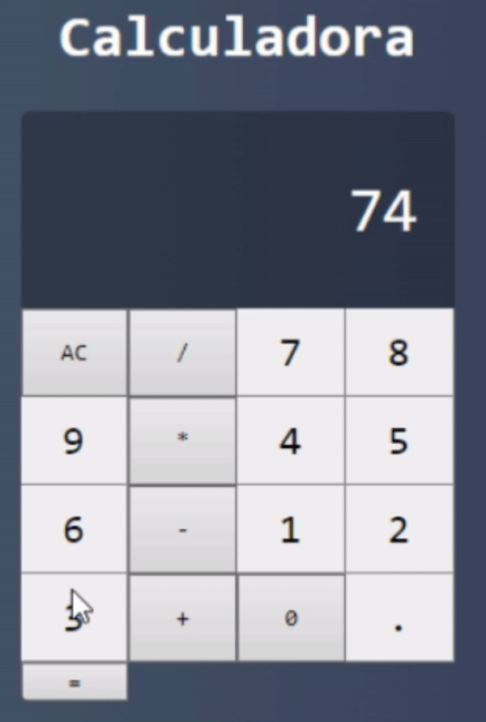

 <h1 align="center" style="color: #afb2b1"> PORTFOLIO LEONARDO FERREIRA </h1>

## ⚙️ Tecnologias utilizadas: 
✔️ [Node.JS](https://nodejs.org/en/)  
✔️ [React](https://pt-br.reactjs.org)  
✔️ [Webpack](https://webpack.js.org)  
✔️ [Babel](http://babel.io)  

## 💻 USABILIDADE | 📷 Screenshots 

https://user-images.githubusercontent.com/66839023/116494497-4d83f400-a877-11eb-8319-abe04db9ed38.mp4

## 💡 Projeto

 Este é um projeto pessoal para fins de adquirir conhecimento e elevar meu nivel na tecnologia REACT! 

## 📍 Como utilizar 

 Se você é um desenvolvedor e quer utilizar o App em sua maquina local basta instalar as dependencias e executar o comando:  
<h3> 🔍 -- npm run dev -- ou -- yarn dev -- rodando na porta 3031.</h3>

 Para instalar as dependencias basta utilizar o comando:  
<h3> 🔍 --npm-- ou --yarn-- ou se preferir visualize o arquivo "Package.json". </h3>

## 📢 Atualizações 

 Se você quiser contribuir basta puxar um fork e desenvolver em uma branch separada, toda a ajuda, feedback e crítca é aceita! 🚀🚀🚀 

## 📲 Redes sociais

🔗 [LinkedIN](https://www.linkedin.com/in/leonardo-ferreira-253a60173/)  
🔗 [Whatsapp](https://api.whatsapp.com/send?phone=5521997674932)  
🔗 [Facebook](https://www.facebook.com)  
🔗 [Reddit](https://www.reddit.com)
